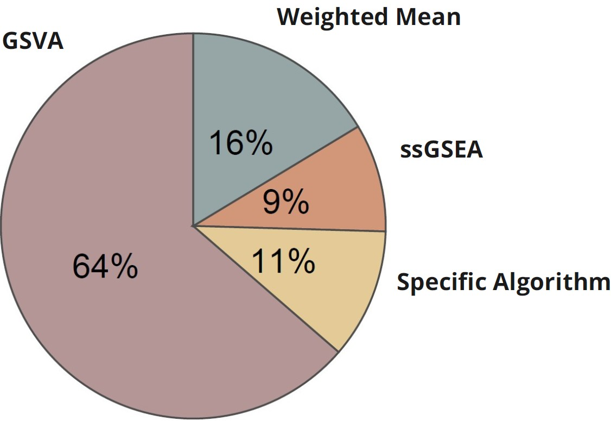

<p align="center">
  
</p>


# SignatureSets: An R Package for RNA-Based Immuno-Oncology Signatures

## Introduction
    
The `SignatureSets` package provides access to a curated and extensive compendium of RNA-based Immuno-Oncology (IO) signatures. All signatures included in this package are:

- Published in peer-reviewed literature.
- Publicly available through trusted repositories and resources.

References to the original publications and resources for each signature are included in the package documentation, refer to the [vignettes](https://github.com/bhklab/SignatureSets/blob/main/vignettes/SignatureSets.Rmd) or accessible via the web application [predictio.ca](https://predictio.ca/). 

## Setup
                                                                 
The latest version of SignatureSets repository can be found on the [SignatureSets GitHub repository](https://github.com/bhklab/SignatureSets). To set up the repository, please download this folder locally:

``` bash

git clone https://github.com/bhklab/SignatureSets
cd SignatureSets

```

### Signature Association Types

In total, 55 Immuno-Oncology (IO) gene signatures have been curated in the SignatureSets package. These signatures were extracted from the literature and manually annotated using [GENCODE version 40](https://pubmed.ncbi.nlm.nih.gov/36420896/), with HUGO Gene Symbols as the primary identifiers linked to Entrez Gene IDs and Ensembl Gene IDs. The signatures are categorized based on their association with IO therapy outcomes:

- 65% (36 signatures): Associated with sensitivity to IO therapy, indicating potential positive responses such as immune activation or enhanced checkpoint inhibitor efficacy.

- 35% (19 signatures): Associated with resistance to IO therapy, highlighting mechanisms like immune evasion, suppressive tumor microenvironments, or other resistance pathways.

                           
## Methods for Computing IO Signature Scores

Signature scores are computed using standardized methods tailored to the characteristics of each signature, as described in their original publications.

- Unweighted Signatures: Scores are computed using Gene Set Variation Analysis ([GSVA](https://bmcbioinformatics.biomedcentral.com/articles/10.1186/1471-2105-14-7)) or Single Sample Gene Set Enrichment Analysis([ssGSEA](https://pubmed.ncbi.nlm.nih.gov/16199517/)) to assess pathway enrichment. GSVA calculates enrichment scores for gene sets without weighting individual genes.

- Weighted Signatures: Scores are computed as a weighted mean expression, where weights are assigned as follows: +1 for increased expression and -1 for decreased expression. 

- Specific Algorithm: Certain signature scores are computed based on their respective original publications, e.g., the [PredictIO](https://pubmed.ncbi.nlm.nih.gov/36055464/) signature. 

<p align="center">
  
  
</p>

More details about signature score computations and their applications can be found on the [PredictioR GitHub repository](https://github.com/bhklab/PredictioR)

## Citation 
                                                                  
If the data from the SignatureSets package are used in your publication, please cite the following paper(s):                                                                  
- [Bareche, Y., Kelly, D., Abbas-Aghababazadeh, F. et al., Annals of Oncology 2022](https://pubmed.ncbi.nlm.nih.gov/36055464/).
                                                                      
