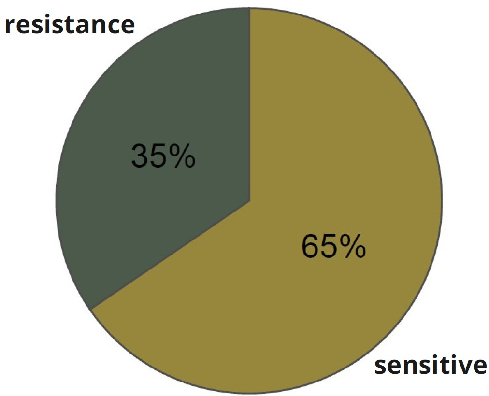

<p align="center">
  
</p>


# SignatureSets: An R Package for RNA-Based Immuno-Oncology Signatures

## Overview

**SignatureSets** provides access to a curated, literature-backed collection of RNA-based gene expression signatures focused on immuno-oncology (IO) and the tumor microenvironment (TME).

All signatures in the package are:
- Published in peer-reviewed literature
- Publicly available through trusted bioinformatics resources


References for each signature—including source publications, accession details, and metadata—are included in:
- [`data-raw/signature_information_io.csv`](https://github.com/bhklab/SignatureSets/blob/main/data-raw/signature_information_io.csv)
- [`data-raw/signature_information_tme.csv`](https://github.com/bhklab/SignatureSets/blob/main/data-raw/signature_information_tme.csv)
- [Vignettes](https://github.com/bhklab/SignatureSets/blob/main/vignettes/SignatureSets.Rmd)
- Web platform: [predictio.ca](https://predictio.ca/)

---

## What's Included

The repository includes:

- **55 IO (Immuno-Oncology) gene signatures**  
- **90 TME (Tumor Microenvironment) gene signatures**  
    - TME signatures were extracted using the [`IOBR`](https://github.com/IOBR/IOBR) package.

All genes have been standardized to **GENCODE v40** annotations using HUGO Gene Symbols, and mapped to **Entrez** and **Ensembl** gene identifiers using the **biomaRt** R package.

---

## Repository Structure

```plaintext
SignatureSets/
├── 📁 data/                        # Processed signature data (.rda files)  
├── 📁 data-raw/                    # Processed signature data and metadata (.csv files) 
├── 📁 vignettes/                   # Summaries and usage examples of signature data
└── 📄 README.md                    # Repository overview and documentation
```

---
### IO Signature Association Types

The 55 IO signatures are categorized by their association with response to immuno-oncology therapy:

- 36 signatures (65%): Associated with sensitivity to IO therapy, indicating potential positive responses such as immune activation or enhanced checkpoint inhibitor efficacy.

- 19 signatures (35%): Associated with resistance to IO therapy, highlighting mechanisms like immune evasion, suppressive tumor microenvironments, or other resistance pathways.

                           
## Methods for Computing Signature Scores

Signature scores are computed using standardized methods tailored to the characteristics of each signature, as described in their original publications.

- **Unweighted Signatures**: Scores are computed using Gene Set Variation Analysis ([GSVA](https://bmcbioinformatics.biomedcentral.com/articles/10.1186/1471-2105-14-7)) or Single Sample Gene Set Enrichment Analysis([ssGSEA](https://pubmed.ncbi.nlm.nih.gov/16199517/)) to assess pathway enrichment. GSVA calculates enrichment scores for gene sets without weighting individual genes.

- **Weighted Signatures**: Scores are computed as a weighted mean expression, where weights are assigned as follows: +1 for increased expression and -1 for decreased expression. 

- **Specific Algorithm**: Certain signature scores are computed based on their respective original publications, e.g., the [PredictIO](https://pubmed.ncbi.nlm.nih.gov/36055464/) signature. 

More details about signature score computations and their applications can be found on the [PredictioR GitHub repository](https://github.com/bhklab/PredictioR)

<p align="center">
  
  
</p>

---

## Setup
                                                                 
The package is not yet available on CRAN or Bioconductor. You can install it by cloning the repository:

``` bash

git clone https://github.com/bhklab/SignatureSets
cd SignatureSets

```

## Citation 
                                                                  
If you use SignatureSets in your research, please cite:

- [Bareche, Y., Kelly, D., Abbas-Aghababazadeh, F. et al., Annals of Oncology 2022](https://pubmed.ncbi.nlm.nih.gov/36055464/).
- For TME signatures extracted via IOBR, please cite the corresponding IOBR publication [PMID: 39626665](https://pubmed.ncbi.nlm.nih.gov/39626665/).
                                                                      
